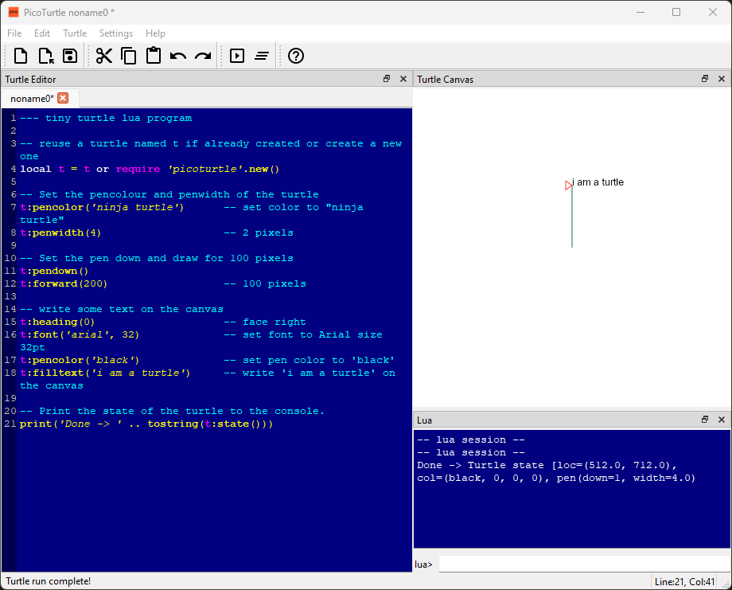

# Getting Started

The latest PicoTurtle version is [`0.2.0-alpha.4`](https://github.com/abhishekmishra/picoturtle/releases/tag/v0.2.0-alpha.4). For more details about the changes in the latest release see - [Release Notes](CHANGELOG.md)

## Download and Install

### Windows

The windows installation is a straightforward process using a graphical installer. You can download it here [PicoTurtle Win/64-bit](https://github.com/abhishekmishra/picoturtle/releases/download/v0.2.0-alpha.4/picoturtle-0.2.0-win64.exe)

Once the program is installed - the program named PicoTurtle is available in the start menu.

### Mac

__TBD__

### Linux

__TBD__

## Launch

On launching PicoTurtle application you will see a window similar to the one below. It will have a menubar, toolbar, editor area, a canvas, a lua console, and a status bar.

You can decide to dive-in right away if you're familiar with interfaces like this. However if you would like walkthrough of the interface see the [PicoTurtle User Guide](userguide.md).

For details about the turtle drawing commands see the [PicoTurtle API](api.md).

