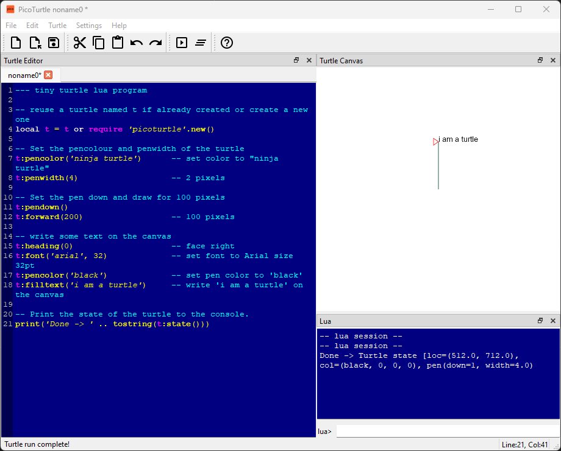

# PicoTurtle

PicoTurtle is a **"Lua Turtle Graphics Programming Environment"**. 

Lua Turtle Graphics Programming Environment. Now that's a mouthful!. So let's break it down...

## Programming Environment
A Programming Environment or an "Integrated Development Environment" is a software program that provides a toolset to "design, develop, run, visualize the results of, and debug programs".

PicoTurtle is **a programming environment** which provides libraries, command-line tools and a desktop application to design and develop graphics programs written in the "Lua Programming Language" using "Turtle Graphics APIs".

## Turtle Graphics
Turtle Graphics is one of the simplest ways of drawing on a screen using simple vector graphics. You (the turtle graphics programmer) are provided an empty canvas on the screen, and a drawing agent (usually called a turtle) which responds to some basic drawing and movement commands.

The simplicity of the turtle graphics programming environment with just a canvas and a drawing turtle are deceptive. These two provide sufficient power to draw curves, shapes, text in infinite ways. Turtle grapics enables the exploration of two-dimensional geometry using programs instead of formulas. It enables exploration of programmatic drawing using generative graphics programs.

Since PicoTurtle provides Turtle Graphics APIs in the Lua programming language, one can explore and draw graphics in the PicoTurtle desktop application - and then include them in their own Lua programs.

If you're new to Turtle Graphics, start with the [Introduction to Turtle Graphics].

## Lua Programming Language
Lua is a simple and easy to learn programming language. It is designed for embedded-use in programs to allow users to change program behaviour without rebuilding the application. If you don't get what the last sentence means, don't worry!

What you need to understand is Lua is a easy to learn. It is perhaps one of the easiest programming languages to learn. However it still is an incredibly powerful language.

If you're new to programming or to Lua programming the PicoTurtle [Programmer's Guide] will provide a gentle introduction to a few Lua concepts - enough to create interesting graphics programs. However at some stage you will want to use the full power of the Lua programming language - and at this stage you can head over to [Learning Lua].

## PicoTurtle Desktop Application

## PicoTurtle CLI

Sometimes you've got a program which you just want to run as a script - and generate results based on some input. The PicoTurtle CLI program `ptcli` allows one to run a turtle lua program from the command line.
