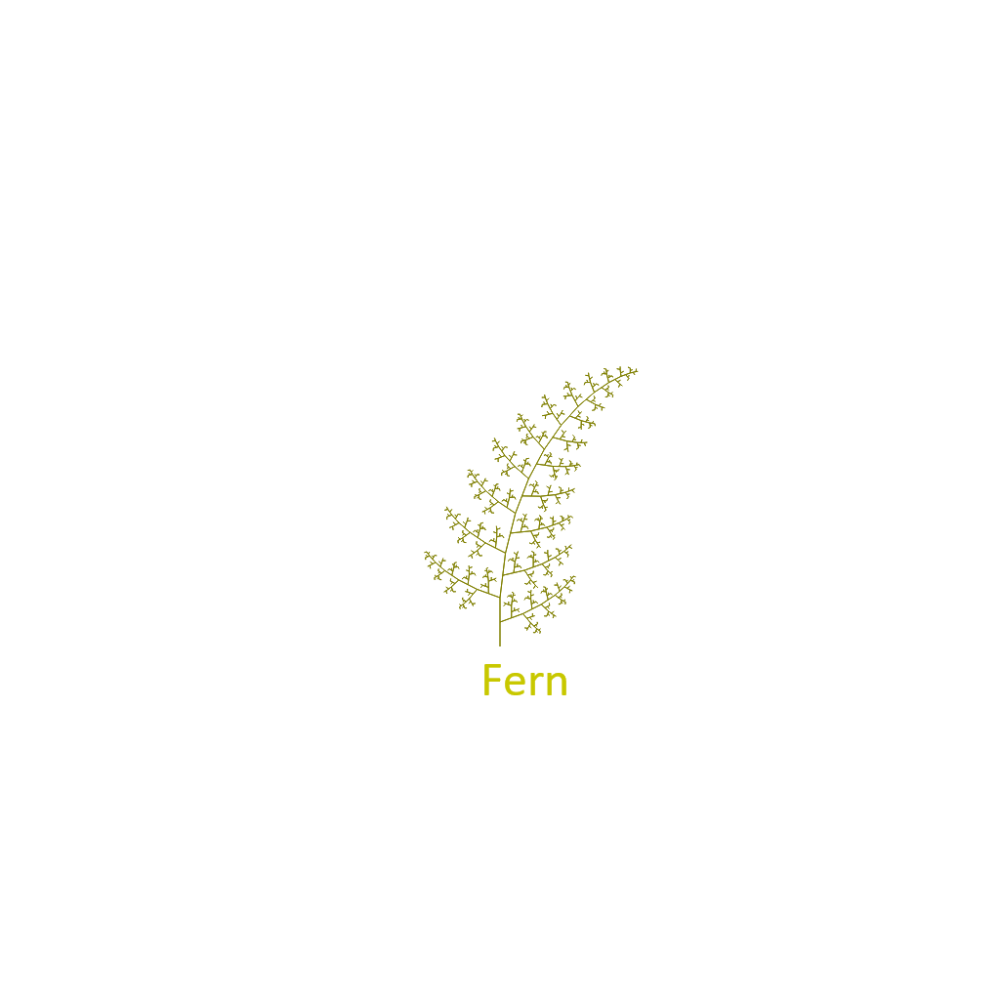

# fern

## Program

```lua
-- fern.lua
-- Author: Abhishek Mishra
-- Date: 15/01/2022
--
-- Draws a fern
--

-- fern: function which
-- calls itself recursively
-- till the size is less than 1
-- to draw the fern.

local picoturtle = require "picoturtle"

-- if called from another script, t will be set to a turtle object
-- if t is not set to a turtle (i.e. it is nil) then create a new one.
local t = t or picoturtle.new()

-- reset turtle in case we are reusing a passed turtle object
t:reset()

function fern(size, sign)
    if (size < 1) then
        return
    end

    t:forward(size)

    t:right(70 * sign)
    fern(size / 2, sign * -1)
    t:left(70 * sign)

    t:forward(size)

    t:left(70 * sign)
    fern(size / 2, sign)
    t:right(70 * sign)

    t:right(7 * sign)
    fern(size - 2, sign)
    t:left(7 * sign)

    t:forward(-size)
    t:forward(-size)
end

t:penup()
t:back(200)

t:right(90)
t:back(20)
t:pencolor(200, 200, 0)
t:font('Calibri', 50)
t:filltext('Fern')
t:forward(20)
t:left(90)
t:forward(50)

t:pencolor(128, 128, 0)
t:pendown()
fern(25, 1)

```
## Output Image



