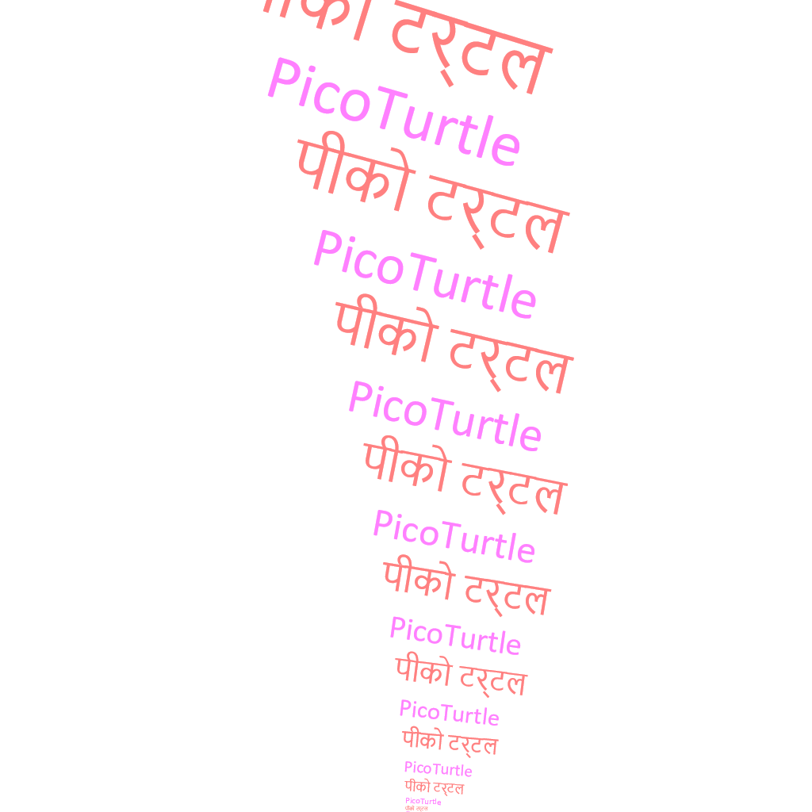

# text-demo

## Program

```lua
-- text-demo.lua
-- Author: Abhishek Mishra
-- Date: 15/01/2022
--
-- text demo
--
local t = t or require'picoturtle'.new()
t:reset()

t:penup()
t:back(512)
    
t:pendown()
t:right(90)

for i = 1, 100, 5 do
    local fs = i
	t:save()
	t:heading(i/5)
    if i%2 == 0 then
        t:font('Nirmala UI', fs)
        t:pencolor(255, 128, 128)
        t:filltext('पीको टर्टल')
    else
        t:font('Calibri', fs)
        t:pencolor(255, 128, 255)
        t:filltext('PicoTurtle')
    end
	t:restore()
    t:penup()
    t:left(90 + 1)
    local mv = i * 1.5
    t:forward(mv)
    t:right(90)
    t:pendown()
end
```
## Output Image



