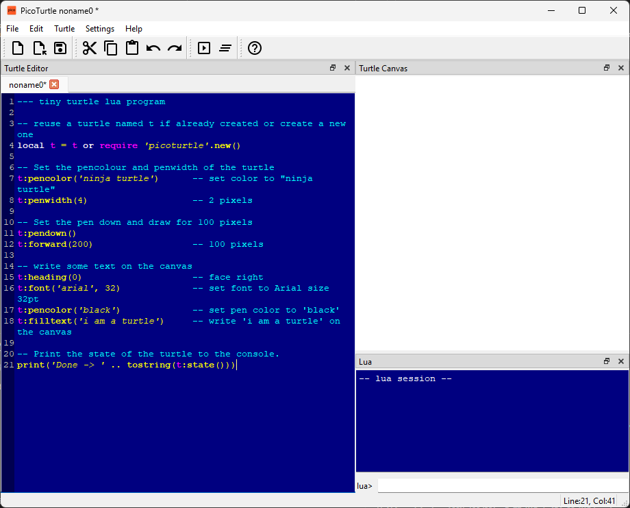

# PicoTurtle User Guide

The PicoTurtle Desktop Application is a simple and intuitive interface.
Therefore it doesn't need any long explanations. Here I present a high-level
overview of how the application is organized - and what each part does.

I urge that you take a quick look at this document and then try things out
yourself. If there are any doubts or questions you can always come back to it
and refer to the relevant area.

_Note: This document is work in progress..._

## PicoTurtle App

When you launch the PicoTurtle desktop application on your system you are
presented with a single window. This window already shows most of the parts
of the app.

### PicoTurtle at Launch

### Overview

With the newly launched PicoTurtle open, if you hit the key "F5" or click the 
button which looks like the play button (with a tiny triangle), you will run 
the default turtle program and the code will draw some lines and text on the 
canvas.

The PicoTurtle application has the following key parts which are highlighted
in the next screenshot:

1. **Titlebar**: shows the currently open file. An asterix indicates if the
   currently open file has unsaved changes.
2. **Menubar**: Provides access to all the application functions via menus and
   nested sub-menus.
3. **Toolbar**: Provides access to some frequently used functions via toolbar
   buttons.
4. **Turtle Lua Code Editor**: You will spend most of your time here - editing
   turtle commands and code.
5. **Turtle Canvas**: When a turtle program is run, it draws on a canvas. The
   canvas is displayed in this panel to the right of the window.
6. **Lua Console**: Sometimes you want to send a temporary command to the app,
   but do not want to write it in the code editor. You can do this here. This
   console also displays any textual output from the code.
7. **Statusbar**: A few informative items about the application are displayed
   here. For e.g. it shows the current line and column of the cursor in the
   code editor.

### The Lua Editor

### The Turtle Canvas

### Toolbar and Menubar

### Statusbar

### Lua Interactive Console

## PicoTurtle CLI

## PicoTurtle Library

### C Library Usage

### Lua Module Usage